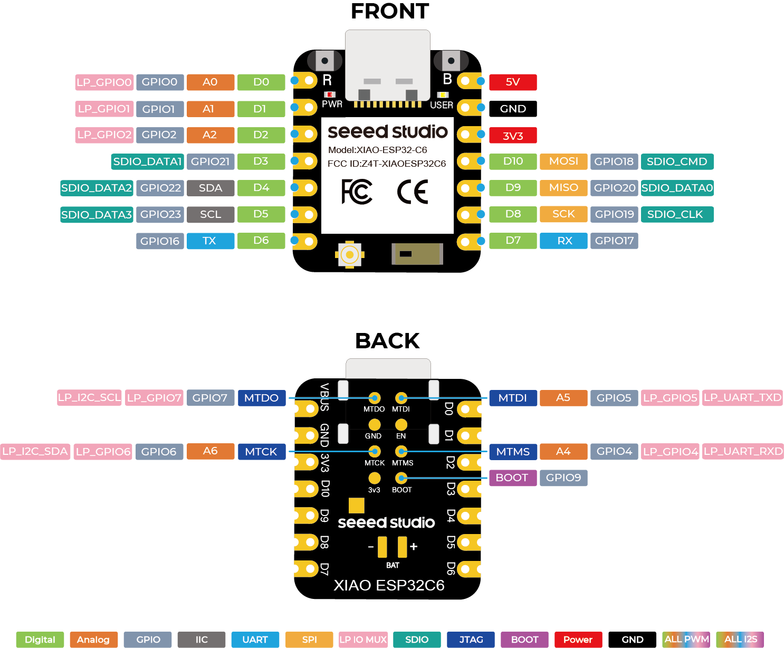

# neopixel ring on Xiao

1. Uses Arduino IDE and the ESP32 board definitions (Seeed Xiao supported)
   - https://wiki.seeedstudio.com/xiao_esp32c6_getting_started/

   - Uses [FastLED](https://fastled.io/) Arduino library

## Hardware

- USB-A to USB-C cable
- 3 wires for connecting tp 12 RGB LED ring
  - Power, GND, and Data In
- mini breadboard
- Xiao ESP32-C6 with soldered headers

### Hook-up

1. *5V* (USB pass-though) to 5V on LED ring
2. *GND*  to Ground on LED ring
3. *D3* (aka *GPIO21*) Digital output to Data In on LED ring
   - can use another pin as long as code sorrespondance is updated

